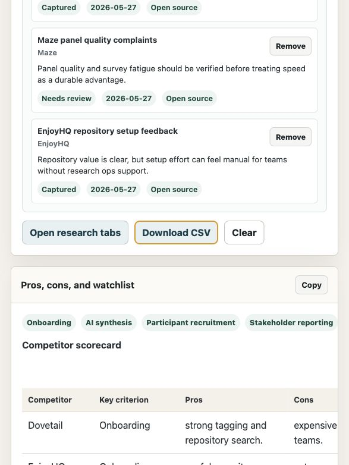

# UX Research OS - Competitive Analysis Release

Release 1 is focused on one workflow: competitive analysis for product research.

Type competitor products, add evaluation criteria, collect public web evidence, maintain a source ledger, and generate a pros, cons, opportunity, risk, and research-queue matrix that can be exported as CSV.

[Live app](https://research-two-nu.vercel.app) · [GitHub repo](https://github.com/jyothivenkat-hub/ux-research-os)



## What is live

- Competitive Analysis UI only.
- No-key server-side competitive research route at `/api/competitive-research`.
- Source ledger with title, URL, product, date, evidence status, and evidence note.
- Evidence parsing from pasted notes and captured public search snippets.
- Competitor scorecard, criterion scorecard, opportunities/risks, research queue, and source ledger output.
- CSV export, local save, JSON export, and JSON import.

The public release has no API keys, no client-side secrets, and no Jira/Linear credentials.

## What is archived

The previous full UX Research OS prototype is backed up in:

`backup/full-os-prototype/`

That archive contains the multi-module workspace for brief generation, questionnaire generation, synthetic personas, transcript synthesis, reporting, and tracker handoff. Those modules are not visible in the release UI.

## Docs

- `docs/code-map.md`: where each file lives and what it owns.
- `docs/backlog.md`: parked modules and next-release candidates.
- `docs/release-plan.md`: release sequence and acceptance criteria.

## Run locally

Use the Node server so live competitive research works locally:

```bash
node server.js
```

Then open:

```text
http://localhost:8000
```

Opening `index.html` directly still loads the static UI, but live competitive research requires the server route.

## Deploy

Deploy from the repo root:

```bash
vercel --prod
```

## Current status

Competitive Analysis is the only released workflow. The rest of the UX Research OS remains documented and archived so we can add one module at a time later.
